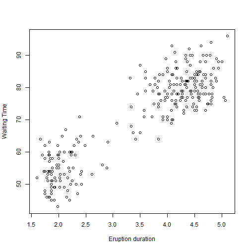

<!-- Limit image width and height -->
<style type='text/css'>
img {
    max-height: 320px;
    max-width: 320px;
}
</style>

<!-- Center image on slide -->
<script src="http://ajax.aspnetcdn.com/ajax/jQuery/jquery-1.7.min.js"></script>
<script type='text/javascript'>
$(function() {
    $("p:has(img)").addClass('centered');
});
</script>

## About the project

This is my slidify project done as part of Develop Data Project Course.

In this presentation we could see that using slidify we can produce presentation directly by executing R Code (embedded code chunks).

Using slidify we can create presentation using HTML5.

Slidify presenations are just HTML files.

Note: Sometimes, I got "object not found error"... to avoid this I attached dataset again in last 2 slides.

---

## Loading Dataset

Faithful data set (available as part of R) is about waiting time between eruptions and the duration of the eruption for the Old Faithful geyser in Yellowstone National Park, Wyoming, USA.
This has a data frame with 272 observations on 2 variables.
First field is eruptions (in mins), Second field is waiting time (in mins)


```r
attach(faithful)
summary(faithful)
```

```
##    eruptions        waiting    
##  Min.   :1.600   Min.   :43.0  
##  1st Qu.:2.163   1st Qu.:58.0  
##  Median :4.000   Median :76.0  
##  Mean   :3.488   Mean   :70.9  
##  3rd Qu.:4.454   3rd Qu.:82.0  
##  Max.   :5.100   Max.   :96.0
```

---
## Creating Eruption Histogram

Using faithful data set we will be creating a histogram using R code. 

```r
attach(faithful)
hist(eruptions, xlab="Eruption duration", ylab="Waiting Time")
```

 

---

## Creating Scattered diagram

Using faithful data set we will be creating a Scattered diagram using R code

```r
attach(faithful)
plot(eruptions, waiting, xlab="Eruption duration", ylab="Waiting Time")     
```

 
Thank you!!
---
